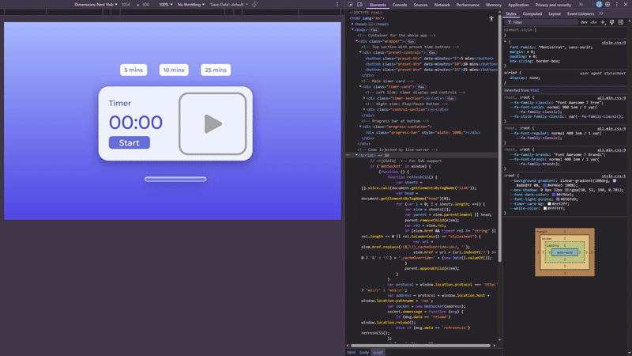

# JS30 - Challenge 29: Countdown Clock

## Project Overview

The challenge was about creating a countdown clock, which is quite the same as a pomodoro timer, so I went ahead and picked up a UI design from behance for the UI and created a pomodoro timer instead, cuz the concepts to be used are mostly the same, but I wanted a better design and work on raw implementation on html, css and js from the first. Solved a couple of edge cases, which I didn't use to do before. The code quality is still not up to the mark (the timer is working fine, but I want more than that), which is why I have listed down all the mistakes and the learnings as well (which I might have forgotten).



---

## 🔴 Critical Mistakes & Fixes

### 1. Using innerHTML for Logic Decisions

**❌ What I Did Wrong:**

```javascript
if (e.currentTarget.innerHTML == "Start") {
  // start timer logic
} else if (e.currentTarget.innerHTML == "Stop") {
  // stop timer logic
}
```

**Why This is Bad:**

- **Fragile**: HTML content can change due to whitespace, formatting, or styling
- **Not Reliable**: Comparing strings from the DOM is error-prone
- **Hard to Maintain**: If you change button text (e.g., for translations), logic breaks
- **Performance**: Reading from DOM is slower than checking JavaScript variables
- **Debugging Nightmare**: Error messages won't tell you the HTML doesn't match

**✅ Correct Approach:**

```javascript
// Use your state variable instead
function handleTimerPlayPause() {
  if (!isTimerSet) return;

  if (!isTimerRunning) {
    startTimer();
  } else {
    stopTimer();
  }
}
```

**Key Lesson:** Always use JavaScript state/variables for logic decisions. The DOM should only reflect your state, not drive it.

---

### 2. Awkward classList Checking

**❌ What I Did Wrong:**

```javascript
if (!currentTargetBtn.classList.value.includes("active")) {
  // do something
}
```

**Why This is Awkward:**

- `.classList.value` returns entire class string: "btn preset-btn active"
- Using `.includes()` on a string can cause false positives
- Example: `"inactive"` includes `"active"` - would match incorrectly!
- Not using the built-in API designed for this purpose

**✅ Correct Approach:**

```javascript
if (!currentTargetBtn.classList.contains("active")) {
  // do something
}

// Or to check if it HAS the class:
if (currentTargetBtn.classList.contains("active")) {
  // do something
}
```

**Key Lesson:** Use `classList.contains()` - it's specifically designed for checking class existence and avoids substring matching issues.

---

### 3. Too Many Global Variables

**❌ What I Did Wrong:**

```javascript
let isTimerSet = false;
let isTimerRunning = false;
let countdownTime, timerID, totalCountDownTime, currentTargetBtn;
```

**Why This is Problematic:**

- **Namespace Pollution**: 6+ variables floating in global scope
- **Hard to Track**: Which variables are related?
- **Debugging Difficulty**: Hard to see complete state at once
- **Accidental Overwrites**: Easy to accidentally reuse variable names
- **Not Scalable**: Adding features means more global variables

**✅ Better Approach - Group Related State:**

```javascript
const timerState = {
  isSet: false,
  isRunning: false,
  countdownTime: 0,
  totalTime: 0,
  intervalId: null,
  activeButton: null,
};

// Now access like: timerState.isRunning
// Can log entire state: console.log(timerState)
```

**Benefits:**

- Single source of truth
- Easy to debug (console.log one object)
- Clear relationships between variables
- Can easily save/restore state
- Prepare for future state management (Redux, Context API)

**Key Lesson:** Group related data into objects. Makes code more organized and maintainable.

---

### 4. Functions Doing Too Much (Single Responsibility Principle)

**❌ What I Did Wrong:**

```javascript
function setTimer(e) {
  currentTargetBtn = e.currentTarget;
  // 1. Check if button is active
  if (!currentTargetBtn.classList.value.includes("active")) {
    // 2. Remove active from all buttons
    presetTimeBtns.forEach((btn) => {
      btn.classList.remove("active");
    });
    // 3. Reset the timer
    resetTimer();
    // 4. Add active class to clicked button
    currentTargetBtn.classList.add("active");
    // 5. Calculate countdown time
    countdownTime = currentTargetBtn.dataset.minutes * 60;
    // 6. Store total time
    totalCountDownTime = countdownTime;
    // 7. Set timer flag
    isTimerSet = true;
    // 8. Update display
    timeDisplay(countdownTime);
  } else {
    // 9. Handle deactivation
    currentTargetBtn.classList.remove("active");
    resetTimer();
  }
}
```

**Why This is Bad:**

- **Hard to Test**: Can't test individual pieces
- **Hard to Read**: Too much happening at once
- **Hard to Debug**: Which part is broken?
- **Hard to Reuse**: Can't reuse parts of this logic elsewhere
- **Violates Single Responsibility Principle**: A function should do ONE thing well

**✅ Better Approach - Split Into Focused Functions:**

```javascript
// Main handler - routes to appropriate action
function handlePresetClick(e) {
  const btn = e.currentTarget;

  if (btn.classList.contains("active")) {
    deactivateTimer();
  } else {
    activateTimer(btn);
  }
}

// Each function has ONE clear job
function activateTimer(btn) {
  clearActiveButtons();
  resetTimer();
  setNewTimer(btn);
}

function setNewTimer(btn) {
  btn.classList.add("active");
  const minutes = parseInt(btn.dataset.minutes);

  timerState.countdownTime = minutes * SECONDS_PER_MINUTE;
  timerState.totalTime = timerState.countdownTime;
  timerState.isSet = true;

  updateDisplay();
}

function deactivateTimer() {
  clearActiveButtons();
  resetTimer();
}

function clearActiveButtons() {
  presetTimeBtns.forEach((btn) => btn.classList.remove("active"));
}
```

**Benefits:**

- Each function has a clear, single purpose
- Easy to test individual functions
- Easy to understand what each function does
- Easy to reuse functions elsewhere
- Easy to debug - know exactly which function has the issue

**Key Lesson:** Keep functions small and focused. If a function does more than one thing, split it up. Function names should clearly describe what they do.

---

### 5. Not Preventing Multiple Intervals

**❌ What I Did Wrong:**

```javascript
function handleTimerPlayPause(e) {
  if (e.currentTarget.innerHTML == "Start") {
    isTimerRunning = true;
    handlePlayPauseUI();
    timerID = setInterval(function () {
      // timer logic
    }, 1000);
  }
}
```

**The Hidden Bug:**
If user clicks "Start" button multiple times quickly (or accidentally double-clicks), you create **multiple intervals** running simultaneously!

**What Happens:**

```javascript
// First click - creates interval #1
timerID = setInterval(...) // timerID = 1

// Second click - creates interval #2, overwrites timerID
timerID = setInterval(...) // timerID = 2

// Now interval #1 is still running but you lost reference to it!
// Timer counts down TWICE as fast
// No way to stop interval #1 anymore (memory leak)
```

**✅ Correct Approach:**

```javascript
function startTimer() {
  // Always clear any existing interval first!
  clearInterval(timerState.intervalId);

  timerState.isRunning = true;
  updateUI();

  timerState.intervalId = setInterval(() => {
    timerState.countdownTime--;

    if (timerState.countdownTime <= 0) {
      completeTimer();
      return;
    }

    updateDisplay();
  }, INTERVAL_MS);
}
```

**Why This Works:**

- `clearInterval()` safely handles null/undefined (does nothing if no interval)
- Ensures only ONE interval is ever running
- Prevents memory leaks
- Prevents timer from running at wrong speed

**Key Lesson:** Always clear an interval before creating a new one. Prevent duplicate intervals from running simultaneously.

---

### 6. Magic Numbers in Code

**❌ What I Did Wrong:**

```javascript
countdownTime = currentTargetBtn.dataset.minutes * 60;
setInterval(function () {}, 1000);

if (countdownTime == 0) {
  // reset
}
```

**Why This is Bad:**

- **What does 60 mean?** Seconds per minute? Minutes per hour?
- **What does 1000 mean?** Could be anything
- **Hard to Change**: Have to find all instances of "60" in code
- **Easy to Mess Up**: Was it 1000 or 1000000 for milliseconds?
- **Not Self-Documenting**: Code doesn't explain itself

**✅ Better Approach - Named Constants:**

```javascript
// At the top of your file
const SECONDS_PER_MINUTE = 60;
const MS_PER_SECOND = 1000;
const TIMER_COMPLETE = 0;

// Now in your code
countdownTime = minutes * SECONDS_PER_MINUTE;
setInterval(callback, MS_PER_SECOND);

if (countdownTime <= TIMER_COMPLETE) {
  completeTimer();
}
```

**Benefits:**

- **Self-Documenting**: Code explains what numbers mean
- **Easy to Change**: Change in one place, updates everywhere
- **Prevents Typos**: Autocomplete helps with constant names
- **Better Refactoring**: Find all uses of a constant easily
- **Intent is Clear**: `SECONDS_PER_MINUTE` is clearer than `60`

**Key Lesson:** Replace magic numbers with named constants. Makes code self-documenting and easier to maintain.

---

## 📚 Important JavaScript Concepts Learned

### 1. setInterval & clearInterval

**Core Concept:**
`setInterval` is like setting a repeating alarm. It returns a "ticket number" (ID) that you must save to stop it later.

```javascript
// setInterval returns an ID (like a receipt)
let intervalId = setInterval(() => {
  console.log("This runs every second");
}, 1000);

// Use that ID to cancel the interval
clearInterval(intervalId);
```

**Mental Model:**

- **setInterval** = "Browser, call this function every X ms, here's ticket #12345"
- **clearInterval(12345)** = "Browser, cancel ticket #12345"

**Critical Rules:**

1. **Always save the interval ID** - without it, you can't stop the interval
2. **Always clear before creating new** - prevents multiple intervals
3. **Clear on cleanup** - especially when timer completes or resets

**Common Pitfall:**

```javascript
// ❌ WRONG - Lost the ID, can't stop it!
setInterval(() => {
  console.log("Unstoppable!");
}, 1000);

// ✅ RIGHT - Saved ID, can stop anytime
let id = setInterval(() => {
  console.log("Can stop me");
}, 1000);
clearInterval(id);
```

---

### 2. String Padding with padStart()

**The Problem:**
Timer showing "1:5" instead of "01:05" looks unprofessional.

**The Solution:**

```javascript
let seconds = 5;
let padded = seconds.toString().padStart(2, "0");
console.log(padded); // "05"
```

**How It Works:**

- `toString()` - converts number to string
- `padStart(targetLength, padString)` - adds characters to start until length is reached

**Examples:**

```javascript
"4".padStart(2, "0"); // "04" - adds one zero
"14".padStart(2, "0"); // "14" - already 2 chars, no change
"124".padStart(2, "0"); // "124" - longer than target, no change
"7".padStart(3, "0"); // "007" - adds two zeros
```

**Timer Implementation:**

```javascript
function formatTime(totalSeconds) {
  const minutes = Math.floor(totalSeconds / 60);
  const seconds = totalSeconds % 60;

  const minStr = minutes.toString().padStart(2, "0");
  const secStr = seconds.toString().padStart(2, "0");

  return `${minStr}:${secStr}`;
}

formatTime(65); // "01:05" ✅
formatTime(125); // "02:05" ✅
formatTime(5); // "00:05" ✅
```

**Key Lesson:** Use `padStart()` for consistent number formatting. Essential for timers, dates, and any display requiring fixed-width numbers.

---

### 3. classList API

**Better than className:**

```javascript
// ❌ Old way - error prone
element.className = "btn active"; // Overwrites all classes
element.className += " disabled"; // Have to manage spaces

// ✅ Modern way - clean and safe
element.classList.add("active");
element.classList.remove("disabled");
element.classList.toggle("hidden");
element.classList.contains("active"); // true/false
```

**Common Methods:**

```javascript
const btn = document.querySelector(".btn");

// Add single or multiple classes
btn.classList.add("active");
btn.classList.add("active", "primary", "large");

// Remove classes
btn.classList.remove("active");

// Toggle (add if missing, remove if present)
btn.classList.toggle("hidden");

// Check if has class (returns boolean)
if (btn.classList.contains("active")) {
  console.log("Button is active");
}

// Replace one class with another
btn.classList.replace("primary", "secondary");
```

**Key Lesson:** Always use `classList` methods instead of manipulating `className` string. Safer, cleaner, and less error-prone.

---

### 4. Data Attributes

**Storing Data in HTML:**

```html
<button class="preset-btn" data-minutes="5">5 mins</button>
<button class="preset-btn" data-minutes="10">10 mins</button>
<button class="preset-btn" data-minutes="20">20 mins</button>
```

**Accessing in JavaScript:**

```javascript
const btn = document.querySelector(".preset-btn");

// Access via dataset
console.log(btn.dataset.minutes); // "5" (string!)

// Must convert to number
const minutes = parseInt(btn.dataset.minutes);
const seconds = minutes * 60;
```

**Multiple Data Attributes:**

```html
<div data-user-id="123" data-user-name="John" data-is-admin="true"></div>
```

```javascript
const div = document.querySelector("div");
console.log(div.dataset.userId); // "123"
console.log(div.dataset.userName); // "John"
console.log(div.dataset.isAdmin); // "true" (string!)

// Convert to proper types
const id = parseInt(div.dataset.userId);
const isAdmin = div.dataset.isAdmin === "true";
```

**Naming Convention:**

- HTML: `data-my-attribute` (kebab-case)
- JavaScript: `dataset.myAttribute` (camelCase)

**Key Lesson:** Use data attributes to store custom data in HTML elements. Always remember values are strings and need type conversion.

---

### 5. Event Delegation vs Direct Binding

**What I Did (Direct Binding):**

```javascript
const presetBtns = document.querySelectorAll(".preset-btn");
presetBtns.forEach((btn) => {
  btn.addEventListener("click", handlePresetClick);
});
```

**Alternative (Event Delegation):**

```javascript
const presetContainer = document.querySelector(".preset-controls");
presetContainer.addEventListener("click", (e) => {
  if (e.target.classList.contains("preset-btn")) {
    handlePresetClick(e);
  }
});
```

**When to Use Each:**

**Direct Binding (what I used):**

- ✅ Simpler to understand
- ✅ Good for fixed number of elements
- ❌ More memory (one listener per element)
- ❌ Won't work for dynamically added buttons

**Event Delegation:**

- ✅ Single event listener (less memory)
- ✅ Works for dynamically added elements
- ✅ Better performance with many elements
- ❌ Slightly more complex code

**Key Lesson:** For my timer, direct binding is fine (only 3 buttons). For lists with many items or dynamic content, use event delegation.

---

## 🎯 Best Practices Applied

### 1. Separation of Concerns

**Principle:** Keep different responsibilities in different functions.

```javascript
// ✅ Good - Each function has ONE job

// Handles user interaction
function handlePresetClick(e) {
  const btn = e.currentTarget;
  if (btn.classList.contains("active")) {
    deactivateTimer();
  } else {
    activateTimer(btn);
  }
}

// Handles UI updates
function updateDisplay() {
  // Only responsible for display logic
}

// Handles state updates
function setNewTimer(btn) {
  // Only responsible for state
}
```

**Benefits:**

- Easy to test each function independently
- Easy to find bugs (know which function is responsible)
- Easy to modify one aspect without breaking others

---

### 2. Consistent Naming Conventions

**Variables:**

```javascript
// Boolean flags - prefix with "is" or "has"
let isTimerRunning = false;
let isTimerSet = false;
let hasCompleted = false;

// Numbers - descriptive nouns
let countdownTime = 0;
let totalTime = 0;
let intervalId = null;

// DOM elements - suffix with element type or descriptive name
const presetBtns = document.querySelectorAll(".preset-btn");
const timeDisplay = document.querySelector(".timer-display");
const startStopBtn = document.querySelector(".start-stop-btn");
```

**Functions:**

```javascript
// Actions - verb + noun
function startTimer() {}
function stopTimer() {}
function updateDisplay() {}
function resetTimer() {}

// Event handlers - prefix with "handle"
function handlePresetClick(e) {}
function handlePlayPause(e) {}

// UI updates - prefix with "update"
function updateUI() {}
function updateProgressBar() {}
```

---

### 3. Guard Clauses (Early Returns)

**❌ Deep Nesting:**

```javascript
function handlePlayPause() {
  if (timerState.isSet) {
    if (timerState.isRunning) {
      stopTimer();
    } else {
      startTimer();
    }
  }
}
```

**✅ Guard Clause:**

```javascript
function handlePlayPause() {
  if (!timerState.isSet) return; // Guard clause - exit early

  if (timerState.isRunning) {
    stopTimer();
  } else {
    startTimer();
  }
}
```

**Benefits:**

- Less nesting (easier to read)
- Handles edge cases upfront
- Main logic is not deeply indented

---

### 4. Semantic HTML & CSS Classes

**Good Class Names:**

```html
<!-- Describes purpose, not appearance -->
<div class="timer-card">
  <div class="timer-section">
    <p class="timer-label">Timer</p>
    <div class="timer-display">00:00</div>
  </div>
  <div class="control-section">
    <button class="play-pause-btn">
  </div>
</div>
```

**Bad Class Names:**

```html
<!-- Describes appearance, not purpose -->
<div class="white-box">
  <div class="left-part">
    <p class="small-text">Timer</p>
    <div class="big-blue-text">00:00</div>
  </div>
</div>
```

**Key Principle:** Name things by what they ARE or what they DO, not how they LOOK.

---

## 🛠️ Debugging Tips I Learned

### 1. Console Log State Changes

```javascript
function startTimer() {
  console.log("Starting timer", timerState);
  // ... rest of code
}

function stopTimer() {
  console.log("Stopping timer", timerState);
  // ... rest of code
}
```

### 2. Check Interval IDs

```javascript
timerState.intervalId = setInterval(() => {
  console.log("Interval running", timerState.intervalId);
  // ... timer logic
}, 1000);
```

### 3. Validate Type Conversions

```javascript
const minutes = parseInt(btn.dataset.minutes);
console.log(typeof minutes, minutes); // Should be "number 5", not "string 5"
```

---

## 📈 Performance Considerations

### 1. Minimize DOM Access

```javascript
// ❌ Accesses DOM every second
setInterval(() => {
  document.querySelector(".timer-display").textContent = formatTime(time);
}, 1000);

// ✅ Cache DOM reference
const display = document.querySelector(".timer-display");
setInterval(() => {
  display.textContent = formatTime(time);
}, 1000);
```

### 2. Avoid Unnecessary Calculations

```javascript
// ❌ Calculates toFixed every render
function updateProgressBar() {
  const progress =
    (timerState.totalTime - timerState.countdownTime) / timerState.totalTime;
  progressBar.style.width = `${(progress * 100).toFixed(2)}%`;
}

// ✅ Only calculate when needed (toFixed(2) probably overkill for progress bar)
function updateProgressBar() {
  const progress =
    ((timerState.totalTime - timerState.countdownTime) / timerState.totalTime) *
    100;
  progressBar.style.width = `${Math.round(progress)}%`;
}
```

---

## 🚀 Future Improvements to Consider

1. **Add Sound Notification** when timer completes
2. **Browser Notifications** when timer ends (using Notification API)
3. **Save State to localStorage** so timer persists on page refresh
4. **Keyboard Shortcuts** (Space to play/pause, R to reset)
5. **Custom Time Input** instead of just presets
6. **Timer History** to track completed pomodoros
7. **Different Alert Sounds** for different timer types
8. **Dark Mode** toggle

---

## 📝 Summary of Key Takeaways

1. **Never use innerHTML for logic decisions** - use state variables
2. **Use `classList.contains()`** not `.value.includes()`
3. **Group related state into objects** - reduces global variable clutter
4. **Keep functions small and focused** - Single Responsibility Principle
5. **Always clear intervals before creating new ones** - prevent bugs and memory leaks
6. **Use named constants** - no magic numbers
7. **`setInterval` returns an ID** - must save it to clear later
8. **Use `padStart()` for formatting** - essential for timer displays
9. **Data attributes are strings** - always convert types
10. **Separate concerns** - UI updates, state changes, event handling should be different functions

---

## 🎓 Skills Developed

- Working with intervals and timers
- State management without frameworks
- DOM manipulation and event handling
- Code organization and structure
- Debugging techniques
- Writing clean, maintainable code
- Understanding performance considerations
- Applying Single Responsibility Principle

---

## 🔗 Resources Used

- JavaScript30 Course - Wes Bos
- MDN Web Docs - setInterval, classList, padStart
- Design inspiration - Behance
- Code review and mentorship - Claude AI

---

**Date Completed:** December 24, 2025  
**Time Spent:** ~3-4 hours (including refactoring and learning)  
**Technologies:** Vanilla JavaScript, HTML5, CSS3
